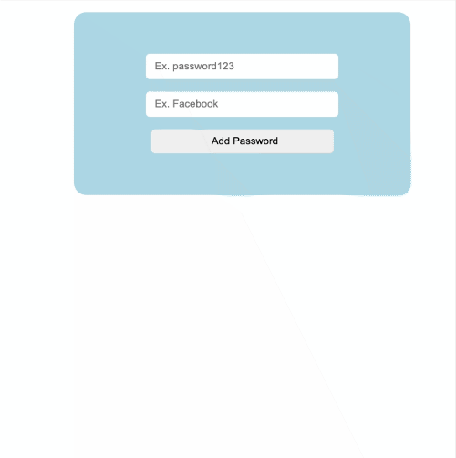
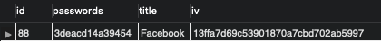

# Password Manager App

#### You can encrpyt/decrpyt your passwords and store them with this CRUD app.

#### By Egemen Kar

## Preview

An example for how a password stored in the database.

## Technologies Used

Front-End (Client)

* React
* Axios

Back-End (Server)

* Node JS
* Express
* MySQL2
* Crypto

## Description

This is a CRUD app with the React-Express-NodeJs and MySQL stack. You can store your passwords with encryption. You can encrypt/decrypt, add, store, read, delete and update passwords in the MySQL database.

## Setup/Installation Requirements

* Clone this repository to your desktop.
* You need to have NodeJs and MySQL on your computer.
* You can check [here](https://ladvien.com/data-analytics-mysql-localhost-setup/) to learn about how to setup a local MySQL database.
* Npm install dependencies for client and server.
* "Node index.js" to start the server and "npm start" to start the client side React app.

## License

Licensed under the [MIT License](LICENSE)

Copyright (c) 2021 Egemen Kar